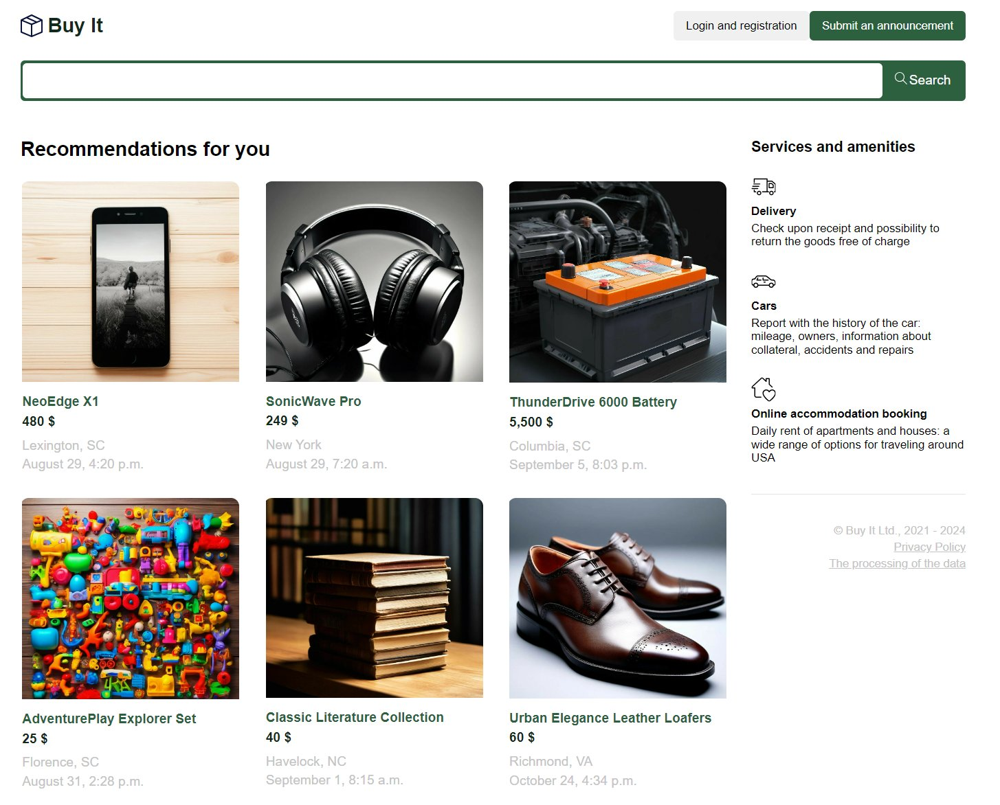

# Buyit-app 

## :books: Languages, Frameworks and Libraries:
- 
- 
- 
- 
- 
- 
  
## :hammer_and_wrench: Tools:
- 
- 
- 

## **Demo:** [https://ksupyl.github.io/buyit-app/](https://ksupyl.github.io/buyit-app/) 

